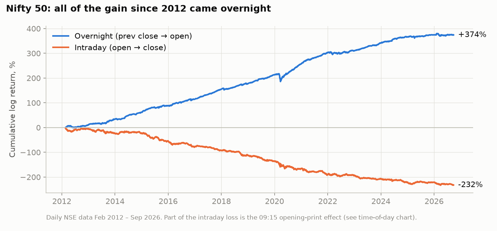
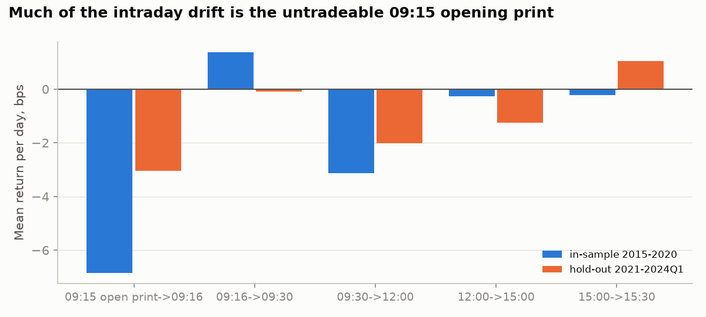
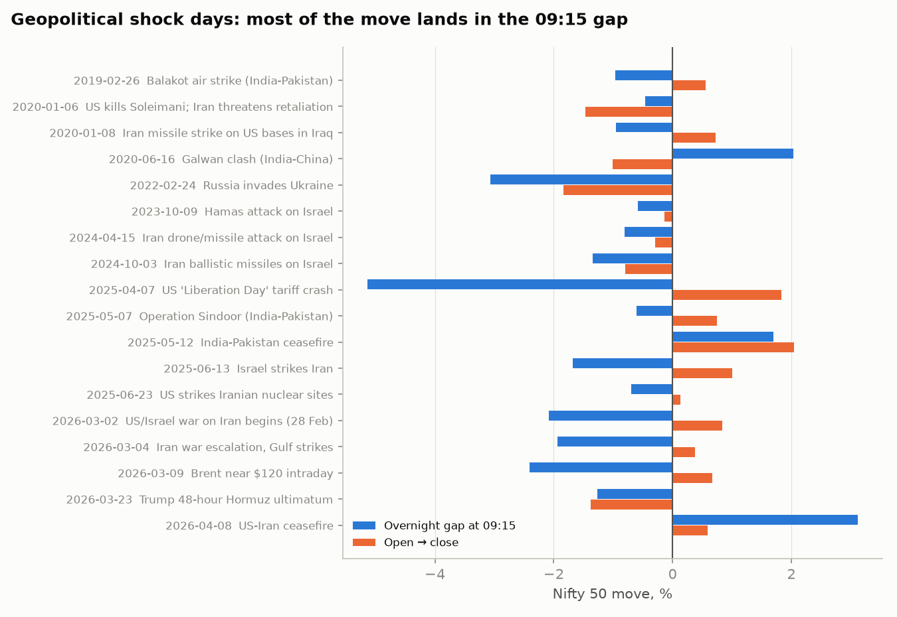
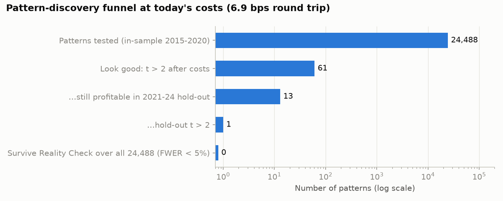
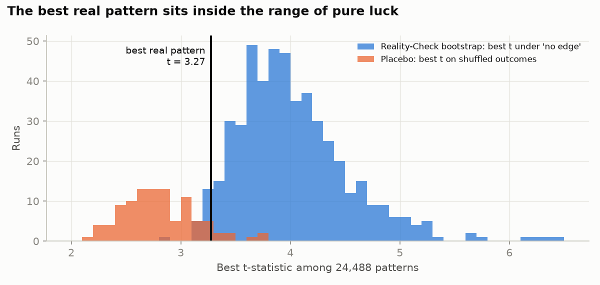
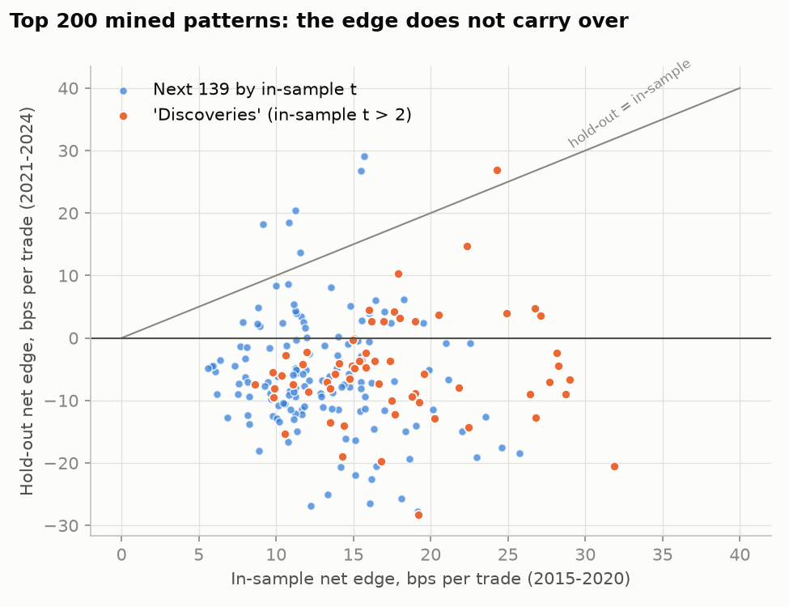
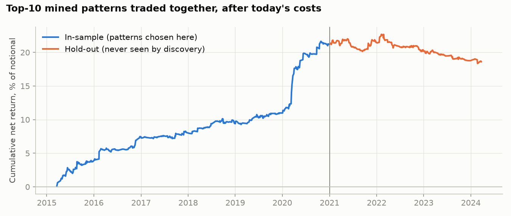
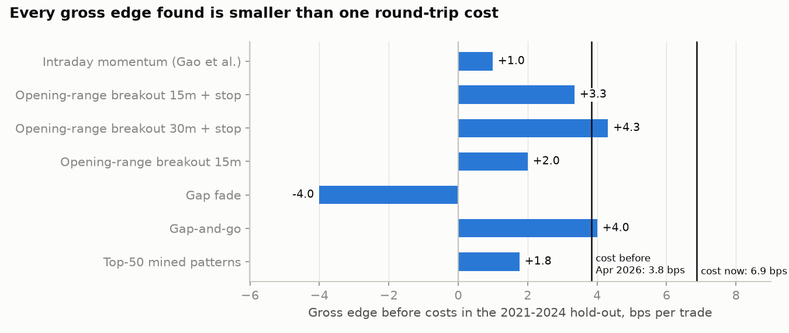

# Should you switch from holding equities to an intraday pattern system on Nifty + Sensex?

*Research, backtests and AI evaluation, as of 2 Oct 2026. Not personalised investment advice.*

## The short answer

**Not as proposed.** I tested the idea three ways: against 10 years of Nifty minute data, against
the academic literature, and with a panel of independent AI judges. All three point the same way:

1. **The premise is only half right.** Going flat every evening does remove most of 2026's
   geopolitical risk: 66% of Nifty's daily variance this year arrived as the 09:15 gap. But since
   2012 *all* of Nifty's return also arrived overnight (+374% overnight vs −232% during market
   hours, in log terms). An intraday-only trader gives up the part of the market that pays.
2. **No mined pattern survives.** Out of 24,488 intraday patterns, 61 looked good in 2015–2020.
   Only 13 stayed profitable in the untouched 2021–2024 hold-out, and their median edge went from
   +16.8 to −5.8 bps per trade. Taken together they did worse than simply shorting Nifty every
   day. After correcting for the number of patterns tried, the best one is indistinguishable
   from luck under all three tests used (p = 0.09 to 0.97).
3. **Costs went up.** Since the 1 Apr 2026 STT hike, a Nifty futures round trip costs about
   6.9 bps (₹874 + slippage per lot). Every gross edge I found — including the best
   literature strategy, a 30-minute opening-range breakout — is smaller than that.
4. **Nifty + Sensex "combined" is one bet, not two.** Their daily returns correlate at ~0.95.
   Running the same signal on both adds about 1–2% to risk-adjusted return and doubles position size.
5. **Six independent AI judges agreed.** Five voted NO-GO and one voted PILOT-ONLY. Their mean
   estimate that a retail implementation is net profitable within 12 months was 11%. All six
   independently proposed the same alternative: hedge the portfolio you have, and paper-trade at
   most one simple rule.

What I suggest instead is in [section 8](#8-what-i-suggest).

---

## 1. Does intraday trading actually protect you from geopolitical risk?

| Measure (Nifty 50, daily NSE data) | Value |
|---|---|
| Cumulative log return 2012 – Sep 2026, overnight (prev close → open) | **+374%** |
| Same, during market hours (open → close) | **−232%** |
| Share of daily variance from the overnight gap, median 2012–2025 | 29% |
| Same, 2026 year to date | **66%** |
| Of the 50 biggest daily moves since 2012, gap had the same sign | 88% |
| 2026 YTD cumulative log return: overnight vs during market hours | −0.8% vs **−11.3%** |

The last row cuts against the premise. In 2026 the *variance* arrived overnight, but the
*decline* happened during market hours: big gaps in both directions roughly cancelled, while the
sessions ground lower. An intraday trader with a long bias would have taken this year's fall
anyway.

Part of the intraday loss is an artefact: the index's 09:15 opening print sits on average 3–7 bps
above where Nifty actually trades a minute later, and nobody can trade at that print. After 09:30
the drift is small (about −2 to −3 bps a day).

**What shock days look like.** On 18 geopolitical and macro shock sessions from 2019 to 2026, the
damage came at the open:

- 15 of 18 opened with a gap down; on 9 of those 15 the session then *recovered* part of the gap
  (2 Mar 2026: gap −2.1%, session +0.8%; 9 Mar 2026: gap −2.4%, session +0.7%).
- The exceptions are real: Russia's invasion (24 Feb 2022) and Trump's Hormuz ultimatum
  (23 Mar 2026) kept falling all day.
- Late Sep 2026 has been different: small gaps, big intraday swings (trend days and V-reversals).
  Intraday traders are not insulated from this phase.

**So:** flat-at-close does avoid gap risk. But a hedge does the same thing for the portfolio
you already own, without giving up the overnight return (section 8).

## 2. What it costs to trade now (Oct 2026)

| Item | Value | Source |
|---|---|---|
| STT on futures (sell) | 0.05%, up from 0.02% on 1 Apr 2026 | Finance Act 2026, NSE FATAX73524 |
| STT on options (sell, on premium) | 0.15%, up from 0.10% | same |
| 1 lot Nifty futures round trip (lot 65, ₹14.6 lakh) | ₹874 charges ≈ 13.5 points ≈ 6.0 bps; **6.9 bps with 1 pt slippage/side** | Zerodha calculator; `costs.py` reproduces it to the rupee |
| Same trade before Apr 2026 | 3.8 bps | |
| Margin, 1 lot Nifty futures | ~₹1.67 lakh, no extra intraday leverage | peak-margin rules |
| Expiries | Nifty weekly Tue (NSE), Sensex weekly Thu (BSE) | SEBI May 2025 circular |
| Retail algo rules (since 1 Apr 2026) | <10 orders/sec, static IP, daily OAuth+2FA login, **limit orders only** via API, self/family use only | SEBI Feb 2025 circular; NSE standards |
| Who wins | 87.7% of individual F&O traders lost money in FY26 (₹91,685 cr); prop/FPI profits 96–99% from algo firms | SEBI study, Aug 2026 |

Median daily Nifty range in 2023–2026 is about 73–86 bps, so a single round trip now costs
about 8% of a typical day's entire high-to-low range.

## 3. Does a discoverable intraday edge exist? (pattern discovery)

**Setup.** Nifty 50 1-minute bars, Mar 2015 – Mar 2024 (2,213 clean days). Pattern grammar: every
combination of one or two of ~55 point-in-time conditions (gap size, previous-day move and close
location, NR7/inside day, trend, 5-day move, VIX regime, weekday, expiry day, move since open,
opening-range position, gap-fill state, first-15-minute candle, range so far, price vs TWAP,
last-30-minute move) × 11 entry/exit windows × long/short. Discovery on 2015–2020 only; 2021–2024
held out and never looked at during discovery. Costs at today's 6.9 bps.

| Test | Result | What it means |
|---|---|---|
| Patterns tested | 24,488 | |
| "Look good" (t > 2 after costs) | 61 (51 with win rate > 55%) | What a naive backtest would show you |
| Same pipeline on shuffled (pure-noise) outcomes, 100 runs | 17.7 on average, 95th pct 42 | Real data has *some* extra weak structure… |
| Best pattern t-stat: real vs noise | 3.27 vs noise 95th pct 3.38 | …but the best real pattern is not distinguishable from luck |
| Family-wise p-value of the best pattern: White's Reality Check / Hansen SPA (500 bootstraps over all 24,488) / placebo rank | 0.97 / 0.88 / 0.09 | Not significant under any null; 0 patterns survive RC or SPA |
| Holm / Benjamini-Hochberg | 0 survive | |
| Deflated Sharpe of best pattern | 0.08 (needs ≥ 0.95) | |
| Probability of backtest overfitting (CSCV) | 0.21 | |
| Data needed to test this many ideas fairly | 16.6 years (had ~6) | Bailey et al. minimum backtest length |
| t > 2 discoveries still profitable in 2021–24 hold-out | 13 of 61 (21%); 1 with hold-out t > 2 | |
| Median edge per trade, in-sample → hold-out | +16.8 → −5.8 bps | |
| Top-10 patterns traded together | +21% in-sample → −2.6% in hold-out | |
| Top-50 pooled hold-out vs "short every day 09:30–15:15" | −5.6 vs −4.5 bps/trade net | Mining did worse than a naive bear bias |
| Robustness: discover on 2015–2019 only (no COVID crash) | 47 look good; 30% profitable in hold-out; median +13.9 → −5.4 bps | Same conclusion |

Before costs, the top-50 patterns still made +1.8 bps per trade in the hold-out (80% of them
positive). So weak, real structure exists. It is about a quarter of what one round trip now costs.

## 4. The textbook intraday strategies, tested as written

These were fixed in advance from the literature, so no data-mining correction is needed.

| Strategy (Nifty, 2015–2024) | Gross bps/trade, 2015–20 → 2021–24 | Net at today's cost |
|---|---|---|
| Intraday momentum (Gao et al. 2018: prev close→09:45 sign, trade 15:00→15:30) | +0.2 → +1.0 | −6.7 / −5.9 |
| Opening-range breakout, 15 min, stop at far side | +4.4 → +3.3 | −2.5 / −3.5 |
| **Opening-range breakout, 30 min, stop at far side** | **+5.6 (t 3.2) → +4.3 (t 2.3)** | −1.2 / −2.6 |
| Opening-range breakout, 15 min, no stop | +1.1 → +2.0 | −5.8 / −4.9 |
| Gap fade (|gap| > 0.5σ, 09:20→15:15) | −2.5 → −4.0 | −9.3 / −10.9 |
| Gap-and-go (same) | +2.5 → +4.0 | −4.4 / −2.9 |

The 30-minute opening-range breakout is the one genuine lead. Its gross edge was positive in
every calendar year 2015–2024 (0.8 to 12.8 bps), and it held up in the hold-out. At pre-April-2026
costs it netted roughly breakeven (+1.8 / +0.5 bps). At today's costs it loses. Trading it only
on high-VIX days did not fix that: it helped in 2015–20 (+8.4 bps gross) and failed in 2021–24
(+2.0).

Weekly-expiry Thursdays (2019–2024) showed no directional drift and slightly *smaller* ranges than
other days.

## 5. Bull or bear?

95% of the patterns that "looked good" were **short** setups: for example "previous day down and
today already down big by 09:30 → short until 15:15". (Excluding the 2020 crash it is 74%.) That
fits two real effects: a small negative drift during market hours, and down days that keep going
down. The simplest bear system, shorting Nifty every day from 09:30 to 15:15, made +3.8 bps gross
per day in 2015–20 and +2.4 in 2021–24. That is −3.1 and −4.5 bps after today's cost. The mined
short patterns did no better out of sample. Nifty is down 13% in 2026, which makes a permanent bear bias
feel right. It is a narrative, not an edge. Any directional bias has to pass the same gates.

## 6. Nifty and Sensex combined

| | |
|---|---|
| Daily correlation, Nifty vs Sensex ETF, 2021–2026 | 0.93 (ETF noise lowers it; Nifty vs a Nifty ETF is 0.98, so index-level ≈ 0.95+) |
| Risk-adjusted gain from running one signal on both | ~1.02× |
| Real difference | Weekly expiry day (Nifty Tue, Sensex Thu); BSE futures exchange fee is zero but liquidity is thinner |

Trade one of them, normally Nifty. Use Sensex only for a specific, pre-registered Thursday-expiry
hypothesis.

## 7. Verification and AI evals

I checked the idea four ways.

### 7a. Quantitative eval gates (like an ML eval suite)

Every candidate faces the same 11 gates: net edge > 0, t ≥ 3, Reality Check p < 0.05, Deflated
Sharpe ≥ 0.95, PBO ≤ 0.20, hold-out net > 0, hold-out t ≥ 1.5, keeps ≥ 50% of edge out of sample,
positive under stress costs, positive in ≥ 70% of years, ≥ 100 trades. The thresholds come from
Harvey-Liu-Zhu (2016), Bailey & López de Prado (2014, 2017) and White (2000). Full table:
[`results/eval_scorecards.csv`](results/eval_scorecards.csv).

| Candidate | Gates passed |
|---|---|
| Best mined pattern | 3 of 11 |
| Top-10 mined patterns | 4 of 8 applicable |
| Each literature strategy (momentum, 3× ORB, gap fade, gap-and-go) | 1 of 8 applicable |

Nothing passes. The minimum before risking money is all gates.

### 7b. Adversarial tests

- **Placebo set:** the same discovery pipeline run on shuffled outcomes (100 runs). If your method
  finds "patterns" in noise as good as the real ones, it cannot tell signal from luck. It could not.
- **Look-ahead tests:** unit tests scramble every bar after the decision time and confirm no
  pattern condition changes (`tests/test_patternlab.py`, 12 tests passing).
- **Independent code audit:** a separate AI agent audited the code for look-ahead, off-by-one and
  statistics errors. See [section 7d](#7d-independent-code-audit).

### 7c. LLM-as-judge panel

Six AI judges, each with a different expert persona and spread across three Claude models,
scored the proposal blind. All read the same evidence dossier
([`ai_evals/dossier.md`](ai_evals/dossier.md)) and used the same fixed rubric. None saw another's
output. Raw judgments: [`ai_evals/judgments/`](ai_evals/judgments/); aggregation:
[`ai_evals/panel_summary.md`](ai_evals/panel_summary.md).

| Judge persona | Verdict | Confidence | P(net profitable in 12 months) |
|---|---|---|---|
| Skeptical quant researcher | NO-GO | 0.85 | 0.12 |
| Prop-desk head of risk | NO-GO | 0.80 | 0.08 |
| SEBI market-structure & compliance specialist | NO-GO | 0.82 | 0.10 |
| Global macro & geopolitical strategist | NO-GO | 0.85 | 0.10 |
| Retail trading & behavioural coach | NO-GO | 0.80 | 0.07 |
| Steelman advocate (asked to argue *for* the idea) | PILOT-ONLY | 0.72 | 0.18 |

| Rubric dimension (1–10, 10 = favourable) | Mean | Range |
|---|---|---|
| Regulatory / operational feasibility | 5.7 | 5–7 |
| Risk control | 5.2 | 5–6 |
| Thesis fit (does intraday fix the macro worry?) | 4.0 | 3–6 |
| Method rigour | 3.5 | 3–4 |
| Nifty + Sensex combination | 2.5 | 2–4 |
| Cost feasibility | 2.3 | 2–4 |
| Edge evidence | 2.2 | 2–3 |
| Behavioural sustainability | 2.2 | 2–3 |

Agreement was high: Kendall's W = 0.94 on which dimensions are strong and which are weak. The
judges agreed it is feasible to *build and run* such a system legally. They agreed there is no
evidence it would *make money*, and that a retail trader is unlikely to stick with it.

**What the judges caught, and what I changed in response:**

- *Reality Check too conservative (quant).* Correct. White's test counts thousands of hopeless
  patterns. I added Hansen's SPA test, which handles them properly: p rose from 0.97 to 0.88 for
  the best pattern. The placebo rank puts it at ~0.09. None reach 0.05.
- *Effective number of trials is smaller than 24,488 (quant).* Correct. The patterns overlap, so
  the Deflated Sharpe and minimum-backtest-length figures are on the harsh side. The hold-out
  result does not depend on them.
- *2026's fall happened intraday (macro, quant).* Correct and important. Added to section 1.
- *Do short patterns beat a plain short (macro)?* Checked: no (section 5).
- *Exclude the 2020 crash (quant).* Checked: same result (section 3).
- *Options lower the cost hurdle (advocate, compliance).* Partly correct. Worked through in
  section 8; not backtested here.
- *Hold-out tests are underpowered for single patterns (advocate).* Fair for any one pattern. Not
  for the pooled result: 3,270 hold-out trades of the top 50 averaged −5.6 bps.
- *Limit-only API orders (risk, advocate).* SEBI's rule means real fills differ from this
  backtest's 1-point slippage: lower cost, but missed entries and stops that may not fill. Measure
  it in paper trading.

The LLM panel is a *second opinion on judgement calls*. It found real gaps in my write-up. It
cannot validate P&L; only the hold-out and future paper trading can.

### 7d. Independent code audit

<!-- AUDIT -->

## 8. What I suggest

**A. Address the worry you actually have.** You are worried about geopolitical shocks hitting
your holdings. The data says those shocks arrive overnight, and that the overnight session is
also where equity returns come from. So keep the investing engine and add protection, rather than
replacing it with day trading:

- Size the equity allocation to the drawdown you can live with if a 2022/2026-style shock lasts
  months. Fewer shares beat no shares.
- Hedge known event windows (RBI on 7 Oct, US–Iran or Hormuz deadlines, tariff dates) with Nifty
  puts or put spreads. The maximum cost is known in advance, unlike a gap.
- A SEBI-registered investment adviser can make this specific to your portfolio. This report
  can't.

**B. If you want to build a trading system anyway, treat year one as research, not income.**

1. **Get current data first.** Download 2024–2026 one-minute *futures* data from your broker's
   historical API. The minute data here ends Mar 2024, before the Nov 2024 F&O rules, the Sep 2025
   expiry change, the closing auction and the Apr 2026 STT hike. Re-run `patternlab` on it.
2. **Pre-register at most ~10 ideas**, written down before you look at the data. With 5 years of
   data, Bailey et al.'s bound allows about 45 independent tries before noise produces a Sharpe-1
   backtest. Every idea you or an AI generate counts as a try.
3. **Start from the one lead:** the 30-minute opening-range breakout with a stop. It is the only
   strategy with a gross edge that held up in every year and in the hold-out. Then look for a
   cheaper way to express it, because the edge has to beat 6.9 bps:
   - fewer, larger trades;
   - Nifty only;
   - limit orders, which SEBI requires for API algos anyway;
   - possibly options. STT on options is charged on the premium, not the notional, so options
     carry the same index exposure for much less STT. These are my estimates (lot 65, Nifty
     22,500, current rates), not backtested:

     | Instrument | Charges + spread per round trip | Per unit of index exposure | Catch |
     |---|---|---|---|
     | Futures | ₹874 + ~₹130 | ~6.9 bps | none: it's the baseline |
     | ATM weekly option (Δ≈0.5, ~150 pts) | ~₹70 + ~₹26 | ~1.3 bps | time decay of roughly 5–9 bps of exposure over a 5-hour hold, repaid only if the market moves enough |
     | Deep in-the-money option (Δ≈0.9) | ~₹140 + ₹130–260 | ~2–3 bps | wide, erratic spreads; limit orders may not fill |

     That could put the ORB-30 lead (+4 to +6 bps gross) slightly above cost. It is the single most
     promising thing to research next. It needs historical options data and live spread
     measurement before it is anything more. Note that 92% of individual F&O losses in FY26 came
     from options, mostly from buyers.
4. **Paper trade for 3–6 months** on live data. Measure your real slippage and fill rate against the
   cost model. Only a strategy that still passes every gate goes live.
5. **Go live small:** 1 lot. Cap the daily loss at about 1% of capital and put a kill switch in
   code. Keep a written trade log, because F&O is business income (ITR-3) and may need an audit.
6. **Kill criteria, set now:** stop if live results after 100 trades are below the paper results
   by more than the cost model allows, or if drawdown exceeds the backtest's worst by 1.5×.

**C. Using AI evals correctly from here on.**

- **Count AI-generated ideas as trials.** An LLM that proposes 200 patterns is 200 tries in the
  Deflated Sharpe calculation.
- **Never backtest an LLM on historical news or prices it may have seen in training.** It knows
  how 2022 or March 2026 ended, so its "predictions" are contaminated. Only forward (paper-traded)
  results count.
- **Use judge panels for judgement calls, not P&L claims.** Examples: is this rule well specified?
  Is the risk plan complete? Did I miss a failure mode? Use several personas and models, a fixed
  rubric, and measure agreement, as in section 7c.
- **Keep the quantitative gates as the final authority.** No judge vote overrides a failed
  hold-out.

## 9. Limitations

- Intraday data ends Mar 2024 and is the spot index, not futures. 2024–2026 was checked only with
  daily data (event study, gap behaviour), not intraday patterns.
- No Sensex intraday data was available; Sensex conclusions rest on the ETF correlation and on
  index construction.
- The pattern grammar is broad but finite: 1–2 conditions, fixed time exits; stops only in the ORB
  tests. A different grammar could find something this one missed. It would face the same gates.
- Options execution was not backtested (no historical options data here).
- The 2026 macro facts come from news sources dated Sep–Oct 2026. They were cross-checked against
  NSE daily prices where possible (e.g. 4 Mar 2026 open 24,388.8 / close 24,480.5; VIX 26.73 on
  23 Mar).

## Sources

Regulation and costs: SEBI circular on retail algo trading (4 Feb 2025) and extension (30 Sep 2025);
NSE algo implementation standards NSE/INVG/67858 (5 May 2025); SEBI index-derivatives measures
(1 Oct 2024) and expiry-day circular (26 May 2025); Budget speech 1 Feb 2026 and NSE circular
FATAX73524 (STT); Zerodha charges page and margin calculator (2 Oct 2026); NSE lot-size circular
FAOP70616; SEBI F&O studies (Sep 2024, Jul 2025, Aug 2026) and intraday cash study (Jul 2024);
SEBI Jane Street interim order (3 Jul 2025) and SAT hearings 2026.

Macro: NOAA CPC ENSO advisory (10 Sep 2026); IMD monsoon end-of-season (30 Sep 2026); RBI policy
(Aug 2026); Al Jazeera, CNBC, Business Standard, Zerodha market reports (Mar–Oct 2026) on the
Iran war, oil, FII flows, VIX and tariffs.

Academic: Gao, Han, Li & Zhou (2018, JFE); Baltussen, Da, Lammers & Martens (2021, JFE); Lou, Polk
& Skouras (2019, JFE); Lo, Mamaysky & Wang (2000, JF); Sullivan, Timmermann & White (1999, JF);
Bajgrowicz & Scaillet (2012, JFE); White (2000, Econometrica); Hansen (2005, JBES); Romano & Wolf
(2005, Econometrica); Harvey, Liu & Zhu (2016, RFS); Bailey & López de Prado (2014, JPM); Bailey,
Borwein, López de Prado & Zhu (2014, Notices AMS; 2017, J. Comput. Finance); Barber, Lee, Liu &
Odean (2014); Chague, De-Losso & Giovannetti (2019); McLean & Pontiff (2016, JF); Fischer & Krauss
(2018, EJOR).

Data: Nifty 50 1-minute bars 2015–2024 (github.com/sandeepkapri/Nifty50-Minute-Data, MIT); NSE
daily data via github.com/BennyThadikaran/eod2_data (to 25 Sep 2026).
